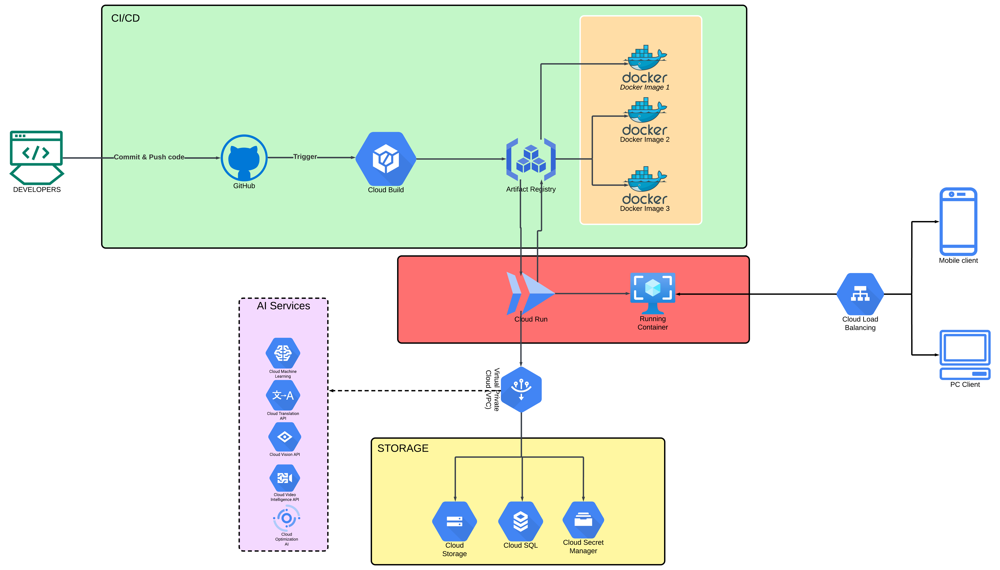

# Core GCP Services Used And It's Architecture

## Architecture Components and Services
To host our Django application and PostgreSQL database, we used the following GCP services, leveraging Cloud Run for a fully managed, serverless environment:

* Cloud Run (for Django App)
    * ``Role``: We deployed our Django application to Cloud Run as a containerized service. Cloud Run was ideal for handling scaling, high availability, and load balancing automatically, allowing us to focus on app functionality rather than infrastructure.
    * ``Implementation``:
        * First, we created a Docker image of our Django app. In the project root, we defined a ``Dockerfile``, specifying our runtime environment, dependencies, and Django-specific configurations.
        * Once the Docker image was ready, we deployed it to Cloud Run. To streamline deployment, we configured Cloud Run to pull this image from Artifact Registry (GCP’s container registry service).

* Cloud SQL (for PostgreSQL Database)
    * ``Role``: Cloud SQL hosted our PostgreSQL database, providing us with a fully managed database service, including automated backups, scaling, and maintenance.
    * ``Implementation``: 
        * We set up a PostgreSQL instance in Cloud SQL and configured it for private IP access to restrict exposure to external traffic.
        * We created a database and user in this Cloud SQL instance with settings compatible with our Django application’s database configurations.

* Cloud Storage (for Static and Media Files)
    * ``Role``: Cloud Storage handled the storage of static assets (such as CSS, JavaScript, and images) and any user-uploaded media files. As GCP’s object storage solution, Cloud Storage allowed us to store and serve static content reliably and at scale.
    * ``Implementation``:
        * Using the django-storages library, we configured Django to interact with Cloud Storage as a backend for static and media files.
        * In Cloud Storage, we created a bucket, assigned appropriate permissions, and configured Django to use this bucket for file storage and retrieval.

* VPC Connector (Networking)
    * ``Role``: To securely connect Cloud Run to Cloud SQL, we configured a Virtual Private Cloud (VPC) connector. This approach allowed our Django app in Cloud Run to communicate with the PostgreSQL database in Cloud SQL securely, without exposing the database to the public internet.
    * ``Implementation``:
        * We created a VPC network and set up a VPC connector within GCP’s VPC settings.
        * When deploying to Cloud Run, we specified this VPC connector, ensuring private IP-based communication between Cloud Run and Cloud SQL.

* Secret Manager (for Sensitive Configuration)
    * ``Role``: Secret Manager securely stored sensitive credentials, such as the database password, Django SECRET_KEY, and any API keys we needed.
    * ``Implementation``:
        * In Secret Manager, we added secrets for each sensitive value, including database credentials and other essential configurations.
        * Within our Django settings, we configured the app to access these secrets programmatically, ensuring they were not hardcoded.

* Cloud Build (for CI/CD)
    * ``Role``: Cloud Build automated the building and deployment of our Docker container to Cloud Run. We configured Cloud Build to automatically trigger on Git commits or pushes to specific branches.
    * ``Implementation``:
        * We set up a ``cloudbuild.yaml`` file, specifying the build steps, such as fetching code, building the Docker image, and pushing it to Artifact Registry.
        * In Cloud Build, we configured triggers to automatically start the build process whenever we pushed changes to our source repository in GitHub.

* Artifact Registry (for Container Images)
    * ``Role``: Artifact Registry stored our Django application’s Docker images, which Cloud Run pulled each time we deployed or updated the app.
    * ``Implementation``:
        * Cloud Build pushed each Docker image version to Artifact Registry, and during deployment, Cloud Run accessed this registry to retrieve the appropriate container image for our Django app.


## Detailed Architecture Flow
Below is a step-by-step, technical breakdown of the architecture flow, from code deployment to request handling, along with specific instructions on how we implement each component in GCP.

1. Code Push and CI/CD Configuration
    * ``Step``: We push our Django project code to a version control repository (e.g., GitHub).
    * ``Configuration``:
        * In the GCP Console, we navigate to Cloud Build > Triggers and create a new trigger.
        * We specify the source repository, branch (e.g., ``main``), and configure it to use a ``cloudbuild.yaml`` file located in our project root.
        * The ``cloudbuild.yaml`` file includes steps for building the Docker image and pushing it to Artifact Registry.
        * Sample ``cloudbuild.yaml``:

        ```yaml
        apiVersion: serving.knative.dev/v1
        kind: Service
        metadata:
        name: YOUR_SERVICE_NAME
        namespace: YOUR_NAMESPACE
        labels:
            commit-sha: YOUR_COMMIT_SHA
            managed-by: YOUR_MANAGEMENT_TOOL
        annotations:
            serving.knative.dev/creator: YOUR_EMAIL
        spec:
        template:
            metadata:
            labels:
                commit-sha: YOUR_COMMIT_SHA
            annotations:
                autoscaling.knative.dev/maxScale: 'YOUR_MAX_SCALE'
            spec:
            containerConcurrency: YOUR_CONCURRENCY
            timeoutSeconds: YOUR_TIMEOUT
            serviceAccountName: YOUR_SERVICE_ACCOUNT
            containers:
            - name: YOUR_CONTAINER_NAME
                image: YOUR_REGION-docker.pkg.dev/YOUR_PROJECT_ID/YOUR_REPO/YOUR_IMAGE:YOUR_TAG
                ports:
                - containerPort: YOUR_PORT
                env:
                - name: YOUR_ENV_VARIABLE
                valueFrom:
                    secretKeyRef:
                    name: YOUR_SECRET_NAME
                    key: YOUR_SECRET_KEY
                resources:
                limits:
                    cpu: YOUR_CPU_LIMIT
                    memory: YOUR_MEMORY_LIMIT
        traffic:
        - percent: 100
            latestRevision: true
        ```

2. Deploy to Cloud Run
    * ``Step``: We deploy the Docker image to Cloud Run.
    * ``Configuration``:
        * In the Cloud Run section of the GCP Console, we select “Create Service” and choose the Docker image from Artifact Registry.
        * We configure the service to use our previously created VPC connector, which ensures secure access to Cloud SQL.
        * We set environment variables for Cloud Run to pull sensitive values from Secret Manager (e.g., database password, Django ``SECRET_KEY``).

3. Database Setup with Cloud SQL and Networking
    * ``Step``: We configure a PostgreSQL instance in Cloud SQL.
    * ``Configuration``:
        * In Cloud SQL, we create a new PostgreSQL instance, set up a private IP, and create a database and user.
        * We update the database settings in our Django app to match the Cloud SQL instance parameters, ensuring private access via the VPC connector.
    * ``Connection``:
        * We assign our Cloud SQL instance to the VPC network and configure it to accept connections only from Cloud Run via private IP.

4. Static and Media File Management with Cloud Storage
    * ``Step``: We configure Cloud Storage to store Django’s static and media files.
    * ``Configuration``:
        * In Cloud Storage, we create a bucket for project files, assign permissions, and install the ``django-storages`` library in our Django app.
        * We set up Django to use ``django-storages`` with Cloud Storage as a backend for static and media file storage.

5. Secret Management with Secret Manager
    * ``Step``: We manage sensitive data securely.
    * ``Configuration``:
        * In Secret Manager, we create secrets for our Django app’s sensitive information.
        * Using the Secret Manager API, we retrieve and inject secrets into environment variables during Cloud Run deployment, keeping sensitive data secure.
        
6. Handling User Requests (End-to-End Flow)
    * ``User Request``:
    * When a user makes a request to our Django app (hosted on Cloud Run), the following process unfolds:
        * Cloud Run routes the request to the Django application.
        * Django App authenticates and processes the request, retrieving necessary data from Cloud SQL if the request involves accessing or updating information stored in the database.
        * If the request requires sensitive information, such as an API key or other secure data, Django accesses Secret Manager on demand. This allows Django to retrieve sensitive data securely while processing the request, avoiding exposure of these details within the app’s code.
        * Static Content: If the request involves serving static content, the Django app fetches it from Cloud Storage.
        * Response: Django processes and sends the response back to the user through Cloud Run, which manages HTTPS encryption and load balancing.
            

## Final Technical Architecture Diagram

To illustrate this architecture in our documentation, we can represent the following connections:

* Source Code (GitHub) → Cloud Build
    * Cloud Build → Artifact Registry (Stores Docker Image)
* Cloud Run (Django App)
    * Cloud Run ↔ Cloud SQL (PostgreSQL Database) (through VPC Connector)
    * Cloud Run ↔ Cloud Storage (Static and Media Files) (direct access)
    * Cloud Run ↔ Secret Manager (for secure access to environment variables)
* User (Client) → Cloud Run (via HTTPS)

This architecture allows us to deploy a fully serverless, scalable solution with Cloud Run, ensuring high availability and robust database management via Cloud SQL, and secure asset storage using Cloud Storage.

